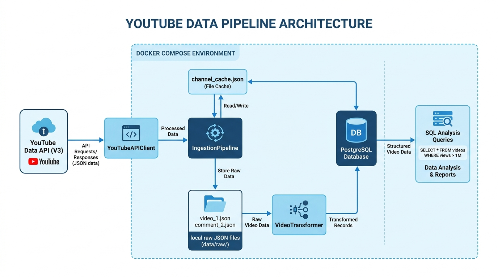

# YouTube Data Pipeline

A Docker-native, production-ready, quota-efficient data pipeline written in Python that ingests videos and comments from target YouTube channels into a relational PostgreSQL database and generates analytics reports.

---

## Architecture Diagram

The system architecture is summarized in the diagram below:



Read our detailed architectural reasoning, database decisions, and scaling thoughts in the [Design Notes](design_notes.md).

---

## Features

* **Cheap & Scalable Handle Resolution:** Resolves channel handles dynamically. To optimize cost, it caches resolved `UC...` IDs inside `data/channel_cache.json`. On subsequent runs, it reads the mapping from the local cache costing **0 quota units**!
* **Batch Ingestion:** Batches requests for video details up to 50 items at a time to optimize network and API limits.
* **Robust Error Handling:** Detects videos with disabled comments and records them gracefully without crashing the pipeline execution.
* **Idempotency:** Implements SQL UPSERT logic (`ON CONFLICT DO UPDATE`) to ensure double runs do not corrupt data or fail.
* **Local Landing Zone:** Saves raw API responses under `data/raw/{channel_id}/{video_id}.json` as an immutable record before parsing.
* **Database Analytics:** Runs optimized PostgreSQL aggregation queries to generate reports like viewer engagement rates and top commenters.

---

## Target Channels

The pipeline is preconfigured in [src/config.py](src/config.py) to ingest data using the following handles:
1. **@AJpluskibreet**
2. **@Saba7oKorah**
3. **@SharkTankEgypt**
4. **@PeaceCake**
5. **@kareemelsayedvlogs**

---

## Getting Started

### Prerequisites

* [Docker](https://www.docker.com/) and [Docker Compose](https://docs.docker.com/compose/) installed on your machine.
* A YouTube Data API v3 API Key.

### 1. Environment Configuration

Copy the environment template file:
```bash
cp .env.example .env
```

Open `.env` and fill in your YouTube API Key:
```env
YOUTUBE_API_KEY=your_actual_youtube_api_key_here
POSTGRES_USER=pipeline
POSTGRES_PASSWORD=pipeline
POSTGRES_DB=youtube
POSTGRES_HOST=postgres
POSTGRES_PORT=5432
```

### 2. Build and Start Services

Launch the Postgres database container and the App runner:
```bash
docker compose up --build -d
```
*The database has a healthcheck block. The app container waits for the database to accept connections before running.*

### 3. Run Ingestion

To run the data ingestion pipeline:
```bash
docker compose run --rm app python main.py
```
**Options & Limits:**
* `--limit-videos N`: Max videos to pull per channel (default: `10`, pulls `50` total).
* `--limit-comments N`: Max comments to pull per video (default: `5`).
* `--dry-run`: Runs the pipeline, saves raw JSON landing files, but skips loading into PostgreSQL.

> [!NOTE]
> **Handle Resolution Caching:**
> The cache file `data/channel_cache.json` is gitignored to avoid checking private maps into Git. On the **first run**, the pipeline queries the cheap `channels` endpoint of the YouTube API (1 quota unit per channel) to resolve the configured handles and writes them to `data/channel_cache.json`. Subsequent pipeline runs read mappings directly from this file, ensuring **0 resolution quota units** are consumed!

### 4. Run Analytics Reports

To run the SQL analytics queries on the ingested data and print tables:
```bash
docker compose run --rm app python main.py --analyze
```

This generates:
* **Report 1:** Top 10 videos by view count.
* **Report 2:** Average comment count per video per channel.
* **Report 3:** Top 10 most active comment authors.
* **Report 4:** Channel-level engagement rate: `SUM(likes + comments) / SUM(views) * 100`.

### 5. Run Automated Tests

To execute the unit tests suite (19 tests covering models, API clients, transformers, database repositories, and pipelines):
```bash
docker compose run --rm app pytest
```
